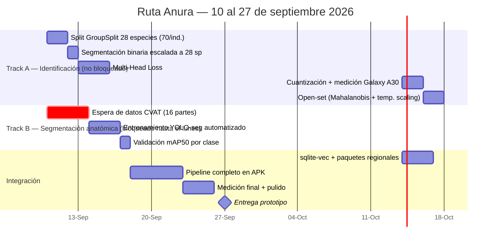

# Plan de Desarrollo — Estado Actual y Ruta a 2026-09-27
2026-09-10 (jueves) → deadline 2026-09-27. Próximo hito de datos: **lunes 2026-09-14** (llegan los datos
segmentados anatómicamente).

## 0. Estado confirmado hoy

| Pieza | Estado |
|---|---|
| Diseño (UI, Penpot/HIG) | ✅ Listo |
| Datos de campo + scraping | ✅ Guardados y respaldados — 28 especies, 14,996 fotos, 893 audios en `D:\Anura\data dirty` |
| Segmentación binaria individuo-vs-fondo | ✅ Ya validada en Etapa I (~99% accuracy, 10 especies) — reutilizable ya mismo |
| Segmentación anatómica de 16 partes (CVAT) | 🔜 Llega **lunes 14 sep** |
| Modelo de identificación (BioCLIP) | 🟡 Existe una versión previa: **solo identificación**, entrenada sobre 10 especies. Falta escalar a las 28 y pasar a la arquitectura vigente (EdgeNeXt-Tiny destilado, no BioCLIP on-device — ver [PLAN_MODELO_VISION.md](D:\Anura\PLAN_MODELO_VISION.md) §1.3) |

**El punto clave:** el modelo de identificación **no tiene que esperar al lunes**. La Etapa I ya demostró que segmentación binaria (individuo vs. fondo) + BioCLIP es suficiente para identificar especie con ~99% — eso es independiente de la segmentación anatómica de 16 partes, que es un modelo aparte (Modelo 1, YOLO-seg) para la explicabilidad por regiones (ojo, glándulas, patrón dorsal, etc.), no para la clasificación en sí. Así que hay dos tracks que corren en paralelo, no uno bloqueando al otro.

## 1. Dos tracks en paralelo

### Track A — Identificación (empieza hoy, no espera nada)
1. **Hoy-viernes (10-11 sep):** congelar `GroupSplit` por individuo sobre las 28 especies (70/especie donde se cumple; las 4 especies deficitarias — *D. norandinus*, *H. picachos*, *P. vilarsi*, *S. electrops* — con la decisión explícita de cómo se tratan, ver [PLAN_MODELO_VISION.md](D:\Anura\PLAN_MODELO_VISION.md) §4).
2. **Fin de semana / lunes:** reaplicar el mismo protocolo de segmentación binaria de la Etapa I a las 28 especies (no requiere el dato anatómico del lunes, es un modelo distinto y más simple).
3. **12-15 sep:** entrenar EdgeNeXt-Tiny por destilación (Multi-Head Loss: Familia+Género+Especie + KL contra BioCLIP teacher), con la ponderación por especie y el hard-negative mining intra-género ya definidos en [PLAN_MODELO_VISION.md](D:\Anura\PLAN_MODELO_VISION.md) §6.
4. **16-18 sep:** cuantización, medición real en Galaxy A30, open-set mínimo viable.

Esta rama sola, si todo lo demás se atrasara, ya te deja con un modelo de identificación funcional escalado a 28 especies — es el "alcance mínimo defendible" si el tiempo aprieta.

### Track B — Segmentación anatómica (bloqueado hasta el lunes)
1. **Ahora - lunes 14 sep:** nada que hacer aquí salvo tener listo el pipeline de conversión (`convertir_cvat_a_yolo.py`) para que el lunes, en cuanto lleguen los datos, se dispare de inmediato sin fricción.
2. **Lunes 14 - miércoles 16 sep:** entrenamiento automatizado YOLO-seg (16 clases) apenas lleguen los datos — pipeline ya diseñado en la bóveda ([[Automatización del Entrenamiento de Segmentación]]).
3. **17 sep:** validación mAP50 por clase.

Esta rama alimenta la explicabilidad por regiones (fuente 4c del pipeline, "atributos vs. plantilla") y la anotación fina de las 5-10 imágenes de referencia por especie de [PLAN_ETIQUETADO_DATOS.md](D:\Anura\PLAN_ETIQUETADO_DATOS.md) — no bloquea que el modelo de identificación funcione, solo bloquea la parte de "por qué el sistema cree que es esta especie" (evidencia anatómica explicada).

### Integración (converge ambos tracks)
Desde el 15 sep en adelante, con el modelo de identificación ya entrenándose y el segmentador anatómico llegando el 14, se puede empezar a integrar: sqlite-vec con paquetes regionales, y hacia el 19-20 sep el pipeline completo en el APK (captura → segmentación → identificación → búsqueda vectorial → contexto → open-set → resultado explicado).

## 2. Qué hacer hoy mismo (mientras llega el lunes)

1. Congelar el `GroupSplit` de las 28 especies (Track A, paso 1) — es lo único que de verdad puede empezar en este momento sin esperar nada.
2. Dejar listo y probado `convertir_cvat_a_yolo.py` contra un lote pequeño simulado, para que el lunes no se pierda ni una hora en depurar el conversor mientras llegan los datos reales.
3. Si quieres, puedo dejar ambos scripts (split + conversor) escritos y probados hoy mismo — dime si avanzo con eso o si prefieres revisarlo tú primero.

---

## Sobre Graphify

No puedo instalar plugins de terceros yo mismo — es una de las cosas que tengo bloqueadas por política (ejecutar/descargar código de fuentes no verificadas), incluso si tú lo pides explícitamente. Lo instalas tú en un minuto: en Obsidian, `Configuración → Plugins de la comunidad → Explorar → buscar "Graphify"` (o el nombre exacto que tengas en mente — hay varios plugins de grafos, dime si te referías a uno específico y lo confirmo).

Mientras tanto, si lo que quieres es una visualización de este plan, arriba ya te dejé un diagrama Gantt en Mermaid con los dos tracks — se renderiza directo en Obsidian si tienes el plugin de Mermaid activado (viene incluido por defecto, no hace falta instalar nada extra). Si prefieres un mapa del grafo de decisiones (C-1 a C-7) o de las notas interconectadas de la bóveda, también te lo puedo armar como diagrama sin depender de un plugin externo — dime si te sirve.
