---
title: "Automatización del Entrenamiento de Segmentación"
proyecto: Anura
tipo: desarrollo-técnico
estado: propuesta-de-diseño
tags: [anura, desarrollo, segmentación, mlops, automatización, yolo-seg]
---

# Automatización del Entrenamiento de Segmentación

[[Anura — Índice General]] · [[Guía CVAT — Índice]] · [[Ciclo de Vida del Modelo (MLOps)]] · [[Optimización para Inferencia en Móvil]] · [[Cronograma y Plan de Trabajo]]

> [!abstract] Por qué existe esta nota
> El equipo entrega **todos los datos de la segmentación semántica** en la semana del 9–11 de septiembre de 2026 ([[Cronograma y Plan de Trabajo]] §0). Con el prototipo debido el 27, no hay margen para que el entrenamiento del segmentador sea un proceso manual e iterativo: tiene que ser un **pipeline** que alguien dispara y supervisa, no algo que alguien programa de nuevo cada vez. Esta nota fija ese pipeline **antes** de que lleguen los datos, para que el día que lleguen solo haga falta ejecutarlo.

## 1. Qué significa "automatizado, solo con supervisión"

No significa AutoML ni búsqueda de arquitectura. Significa que entre "llegan los datos" y "hay un modelo v1 con métricas" no hay pasos manuales de programación — solo una ejecución y una revisión humana de los resultados:

```
Export CVAT ──▶ Script de conversión ──▶ Script de entrenamiento ──▶ Script de evaluación ──▶ Revisión humana
  (dato)         (formato YOLO-seg)         (config fija)              (métricas + muestras)      (aprobar / ajustar dato)
```

La persona supervisa **el resultado**, no escribe el bucle de entrenamiento cada vez. Si algo falla, se corrige el dato o la configuración y se vuelve a correr el mismo pipeline — no se improvisa un script nuevo.

## 2. Dos modelos de segmentación, no confundirlos

| | Segmentación binaria (Etapa I) | Segmentación anatómica (esta nota) |
| --- | --- | --- |
| Qué separa | Individuo vs. fondo | 16 regiones anatómicas (`anuro_completo` + 15 partes) |
| Ya entrenado | Sí — es lo que explica el ~99 % de la Etapa I ([[Modelo de Visión — BioCLIP]] §7) | No — es el que llega la semana del 9–11 sep |
| Formato de anotación | Máscara binaria | Polígonos multi-clase, esquema de la [[Guía CVAT — Índice\|guía CVAT v1.0]] |
| Rol en el pipeline | Recorte limpio antes de BioCLIP (variante C) | Recorte **y** evidencia anatómica para el "por qué" (RF-06, HU-03) |

Documentar formalmente el modelo binario de la Etapa I (arquitectura, entrenamiento) sigue pendiente ([[Modelo de Visión — BioCLIP]] §10) — es un antecedente directo de este pipeline, con menos clases.

> [!warning] El modelo binario dejó de ser una apuesta segura al escalar (2026-09-11/12)
> La fila "Rol en el pipeline: recorte limpio antes de BioCLIP (variante C)" describía el plan, no un resultado confirmado a esta escala. Al probarlo sobre las 41 especies del catálogo actual (no las 10 de la Etapa I), el recorte binario **empeoró** el Top-1 frente a no segmentar (EXP-011 en [[Experimentos y Resultados]]). Causa sin diagnosticar todavía — candidatos: calidad de máscara en fotos de campo más heterogéneas que las 10 especies originales, o pérdida de contexto útil que el ViT sí aprovechaba en imagen completa. **Esta segmentación anatómica (16 clases) sigue siendo un desarrollo aparte, sin relación con ese fracaso** — se retoma cuando sea posible, y su rol de "evidencia del por qué" (RF-06) no depende de que el recorte binario funcione. Ver C-13 en [[Inconsistencias y Decisiones Pendientes]].

## 3. El pipeline, paso a paso

### 3.1 Conversión del export de CVAT

CVAT exporta en varios formatos; el que evita trabajo manual de conversión es **"Datumaro 1.0"** o **"CVAT for images 1.1"** con las máscaras de polígono, convertido a **formato YOLO-seg** (un `.txt` por imagen, clases + polígonos normalizados) mediante un script único y determinista:

```
convertir_cvat_a_yolo.py
  entrada:  export_cvat.zip (Datumaro o CVAT 1.1)
  salida:   dataset_yolo/
              images/{train,val,test}/
              labels/{train,val,test}/
              data.yaml
```

Reglas que el script debe aplicar sin intervención manual:

- **Aplicar el mismo split congelado** del dataset de identificación ([[Estrategia de Construcción del Dataset]]) — el segmentador no puede tener su propia partición aleatoria, o se rompe la trazabilidad de qué imagen fue vista en qué etapa.
- **Excluir automáticamente clases con muy pocos ejemplos** anotados (por debajo de un umbral, p. ej. 5 instancias) y reportarlo en el log, en vez de dejar que el entrenamiento falle a mitad de camino o produzca una clase inservible en silencio.
- **Validar geometría** (polígonos con ≥ 3 puntos, dentro de los límites de la imagen) antes de escribir el `.txt` — un polígono corrupto de CVAT no debe descubrirse a mitad del entrenamiento.

### 3.2 Entrenamiento con configuración fija

Con **Ultralytics YOLO-seg** (ya usado como referencia en [[App Móvil]] y [[Stack Tecnológico]]), el entrenamiento es un único comando/llamada, no un bucle escrito a mano:

```python
from ultralytics import YOLO

modelo = YOLO("yolov8n-seg.pt")  # o yolov8s-seg.pt si el dataset lo sostiene
modelo.train(
    data="dataset_yolo/data.yaml",
    epochs=150,
    imgsz=640,
    patience=20,        # early stopping — evita juzgar a mano cuándo parar
    seed=42,             # reproducibilidad, ver Ciclo de Vida del Modelo (MLOps)
    project="segmentacion_anura",
    name="v1",
)
```

La configuración (`epochs`, `imgsz`, augmentación, `patience`) se fija **una vez**, en un archivo versionado junto al commit ([[Ciclo de Vida del Modelo (MLOps)]] §2), no como argumentos escritos a mano en la terminal cada vez. Si el dataset crece o cambia, se vuelve a correr el mismo comando — eso es "supervisión", no "entrenamiento manual".

> [!tip] Elegir el tamaño de modelo por presupuesto, no por costumbre
> `yolov8n-seg` es el punto de partida porque es el que más margen deja dentro de los 150 MB del RNF-05 junto a BioCLIP ([[Optimización para Inferencia en Móvil]]). Subir a `yolov8s-seg` solo si 
` no alcanza la precisión mínima y sobra presupuesto de tamaño — medirlo, no asumirlo, como en el resto del proyecto.

### 3.3 Evaluación automática y reporte para supervisión humana

El script de evaluación corre sin intervención y produce lo único que la persona necesita revisar:

- **Métricas por clase** (mAP50, mAP50-95, precisión/recall) sobre el split de test — nunca sobre val, que ya se usó para el early stopping.
- **Una cuadrícula de imágenes de muestra** con las máscaras predichas superpuestas (20–30 imágenes, incluyendo las de peor mAP por clase) — es lo que una persona puede revisar en minutos para decidir "esto sirve" sin mirar miles de imágenes una por una.
- **Alerta automática** si alguna clase queda por debajo de un umbral mínimo (p. ej. mAP50 < 0.5), señalando que esa región necesita más anotaciones, no más épocas de entrenamiento.

### 3.4 Qué decide la persona (y qué no)

| Decide la persona | Lo hace el script |
| --- | --- |
| ¿Las métricas y las muestras visuales son aceptables para el prototipo? | Calcular las métricas |
| ¿Qué clase necesita más datos anotados? | Detectar qué clase está por debajo del umbral |
| ¿Se promueve este modelo a "vigente" en el pipeline de identificación? | Registrar la versión, exportar a ONNX/LiteRT |
| Ajustar el conjunto de datos (pedir más anotación de una región) | Convertir, entrenar y evaluar de nuevo con el dataset ampliado |

Ninguna de las columnas de la izquierda requiere escribir código de entrenamiento nuevo. Eso es lo que hace que el proceso quepa en el sprint sin depender de que alguien esté disponible para reprogramar cada corrida.

## 4. Del modelo entrenado al dispositivo

Mismo camino que el resto de los modelos del proyecto — no es un proceso aparte:

```
modelo.pt (Ultralytics)
      ↓  export ONNX / TFLite nativo de Ultralytics
   modelo.onnx / modelo.tflite
      ↓  cuantización INT8 (dataset de calibración del train)
   modelo cuantizado (10–25 MB, ver Optimización para Inferencia en Móvil §5)
      ↓
   Android (LiteRT o ONNX Runtime Mobile)
```

Ultralytics exporta directamente a ONNX y a TFLite (`model.export(format="tflite", int8=True)`), lo que evita un paso de conversión manual adicional al de [[Optimización para Inferencia en Móvil]] §1.

## 5. Qué falta por decidir o medir

- [ ] Confirmar `yolov8n-seg` vs. `yolov8s-seg` con los datos reales (pendiente hasta la entrega del 9–11 sep).
- [ ] Fijar el umbral mínimo de mAP50 por clase que bloquea la promoción a "vigente".
- [ ] Escribir `convertir_cvat_a_yolo.py` y probarlo con un export parcial o sintético **antes** de la entrega real, para no perder los primeros días de la semana 1 del sprint depurando el conversor.
- [ ] Decidir si las clases con pocos ejemplos se agrupan (p. ej. todas las de "tubérculos") en vez de excluirse, siguiendo la misma lógica de agrupación que ya se aplicó al reducir de 18 a 16 etiquetas (I-2 en [[Inconsistencias y Decisiones Pendientes]]).

## 6. Diagnóstico validado — por qué el segmentador binario empeoró el resultado (2026-09-12)

> [!success] Diagnóstico completo, con evidencia cuantitativa y visual — ver EXP-011/EXP-012 en [[Experimentos y Resultados]]
> Tres causas combinadas: (1) el segmentador se entrenó con solo 9 especies y se aplicó a 41 — domain shift real en las 32 no vistas; (2) `fg_medio` (fracción de imagen marcada como rana) es de apenas 6-18% en todo el dataset, señal de que el modelo detecta muy poco foreground incluso en especies conocidas; (3) **bug de diseño**: el recorte tomaba el bounding-box de *todos* los píxeles marcados como foreground, sin filtrar componentes conexos — un solo falso positivo en la esquina opuesta de la imagen bastaba para estirar el recorte hasta casi la imagen completa. Medido sobre 161 máscaras de `Dendrobates_truncatus`: 34,2 % tenían ≥2 "islas" de foreground separadas, y el bbox resultante promediaba el doble del área real de la rana (15,8 % vs. 7,4 %).
>
> **Segundo problema encontrado el mismo día**: el código de `_recortar_por_mascara` solo recortaba la imagen al bbox — **nunca aplicaba la máscara pixel a pixel** (poner el fondo a negro), pese a que esa es la definición documentada de variante C en [[Modelo de Visión — BioCLIP]] §5 y la que sostuvo el ~99 % de la Etapa I. Corregido también.
>
> **Ambos fixes se validaron con un experimento pareado de 3 vías**: mismo modelo (checkpoint vigente, entrenado en variante A), mismas 150 imágenes de test — imagen completa vs. zoom sin máscara vs. zoom con fondo a negro (variante C real):
>
> | | Top-1 |
> | --- | --- |
> | Imagen completa | **60,7 %** |
> | Zoom sin máscara | 50,7 % |
> | Zoom + fondo a negro (C real) | **44,7 %** |
>
> **Resultado contraintuitivo pero consistente**: aplicar la máscara real (fondo a negro) empeora *más* que solo hacer zoom, no menos. Ninguno de los dos fixes, aplicados solo en *inferencia*, resuelve el problema — porque el modelo actual nunca vio ni recortes ni fondos negros en su entrenamiento (mismatch de dominio en ambos casos, más severo cuanto más se aleja la entrada de lo visto). Esto **no** significa que segmentar sea mal camino: significa que la pregunta correcta es otra. La que queda abierta: ¿mejora el Top-1 si se **reentrena** Fase 4 desde cero sobre el recorte con fondo a negro, ya con ambos fixes? Eso no se ha probado todavía — ver EXP-012/EXP-013 en [[Experimentos y Resultados]].

## 7. Diseño propuesto: explicabilidad por parte anatómica (segmentación semántica, 16 clases)

> [!abstract] La pregunta que resuelve
> No es "cuál es la especie" (eso ya lo responde el clasificador global) sino **"por qué"** — RF-06 / HU-03: mostrarle al usuario qué parte de la rana coincide con la especie propuesta y en qué grado, usando las 16 regiones anatómicas de la [[Guía CVAT — Índice|guía CVAT v1.0]] una vez que ese segmentador (distinto del binario) esté entrenado.

Reutiliza exactamente el mismo patrón de ingeniería que ya funcionó para el prior geográfico ([[Optimización para Inferencia en Móvil]] §6): un banco de referencias precalculado + similitud coseno + un peso de combinación — no requiere entrenar nada nuevo más allá del propio segmentador semántico.

```mermaid
flowchart TD
    A[Foto de la rana] --> B["Segmentador SEMÁNTICO<br/>16 regiones anatómicas<br/>(pendiente: datos CVAT, distinto del binario)"]
    B --> C1[Recorte: dorso]
    B --> C2[Recorte: vientre]
    B --> C3[Recorte: patas]
    B --> C4[Recorte: cabeza/tímpano]
    C1 --> D["Mismo encoder BioCLIP<br/>ya extraído (Fase 6/7, fp16)"]
    C2 --> D
    C3 --> D
    C4 --> D
    D --> E1[Embedding dorso]
    D --> E2[Embedding vientre]
    D --> E3[Embedding patas]
    D --> E4[Embedding cabeza]
    F["Banco de prototipos<br/>por (especie, parte)<br/>precalculado sobre train"] --> G{"Similitud coseno<br/>por parte, 0-100%"}
    E1 --> G
    E2 --> G
    E3 --> G
    E4 --> G
    G --> H["Dorso: 91% Dendrobates truncatus<br/>Vientre: 62%<br/>Patas: 84%<br/>Cabeza: no visible"]
    H --> I[Fusión con la predicción<br/>del clasificador de imagen completa]
    I --> J[Resultado + evidencia<br/>por parte, para la UI]
```



**Mecánica del "coincide en X%":**

1. **Banco de prototipos** (cálculo directo, no entrenamiento): para cada (especie, parte anatómica), promediar los embeddings 512-d de esa parte sobre las fotos de train donde esté claramente segmentada — mismo cálculo que el prior geográfico, cambiando coordenadas por vectores de imagen.
2. **Al clasificar una foto nueva**: por cada parte visible y bien segmentada (mismo criterio de `fg_min`/`fg_max` que ya usa GATE 2 del segmentador binario), se recorta, se pasa por el encoder, y se compara contra el prototipo de esa parte para las especies candidatas (top-3 del clasificador global).
3. **El "X%"** es la similitud coseno normalizada (0-100 %) — el mismo tipo de cálculo que ya corre en producción para el prior geográfico.
4. **Partes no visibles u ocluidas** se marcan explícitamente "no observable" — no se fuerza una comparación con ruido. Encaja con el diseño de UI de "presente/ausente/no observable" ya previsto para el 18 sep en [[Cronograma y Plan de Trabajo]].

**Por qué no es solo cosmético:** si una parte da baja coincidencia con la especie top-1 del clasificador global pero alta con la top-2, es señal de que el clasificador se puede estar equivocando — la fusión por partes puede **corregir** la predicción, no solo justificarla. Misma lógica que el prior geográfico: dos fuentes de evidencia independientes combinadas superan a una sola.

**Riesgos a validar antes de construir esto en serio:**
- Requiere que el segmentador semántico esté entrenado primero (sigue pendiente).
- Cobertura desigual por (especie, parte) — mismo problema ya visto con el prior geográfico en especies escasas (`Boana_xerophylla`, `Pristimantis_vilarsi`).
- Las partes no son señales independientes (dorso y patas suelen covariar en patrón de color) — empezar con un peso simple tipo `w=0,75` del prior geográfico y medir el efecto real en Top-1, no asumirlo.

## 8. Estrategia refinada (2026-09-12) — identificar primero, segmentar y explicar después

> [!important] Reemplaza el orden de fusión del §7 a la luz del diagnóstico de hoy
> El §7 proponía segmentar todas las partes y **fusionar** esa evidencia con el clasificador global para decidir la especie (con posibilidad de corregirlo). EXP-011/012/013 (§6, arriba) mostraron que **cualquier transformación de la imagen que el clasificador no vio en entrenamiento — recorte, fondo a negro — le hace daño real** (hasta −16 pp de Top-1). Fusionar evidencia de partes segmentadas en la decisión final arriesgaría meter ese mismo daño por la puerta de atrás. La estrategia refinada evita el riesgo por diseño: **el clasificador global nunca deja de ver la imagen completa** — la segmentación entra únicamente *después*, como capa de explicación, no de decisión.

**El flujo, en el orden correcto:**

```mermaid
flowchart TD
    A[Foto de la rana] --> B["Clasificador global<br/>(imagen COMPLETA, sin recorte —<br/>el que ya funciona: 57% Top-1 / 82% Top-3)"]
    B --> C["Especie más probable<br/>ej. Dendrobates truncatus, 78%"]
    C --> D["Segmentador SEMÁNTICO<br/>16 regiones anatómicas<br/>(pendiente: datos CVAT)"]
    D --> E1[Recorte: dorso]
    D --> E2[Recorte: vientre]
    D --> E3[Recorte: patas]
    D --> E4[Recorte: cabeza/tímpano]
    E1 --> F["Encoder BioCLIP<br/>(ya extraído, fp16)"]
    E2 --> F
    E3 --> F
    E4 --> F
    F --> G["Comparar CADA parte<br/>SOLO contra el prototipo de<br/>Dendrobates truncatus<br/>(la especie ya decidida, no top-3)"]
    G --> H["Dorso: 91% coincide con<br/>el patrón típico de D. truncatus<br/>Patas: 84% · Vientre: 62%<br/>Cabeza: no visible"]
    C --> I[Resultado final al usuario]
    H --> I
```



**Diferencias concretas con el diseño del §7:**

| | §7 (fusión, superado) | §8 (identificar → explicar, vigente) |
| --- | --- | --- |
| Orden | Segmentar todas las partes → comparar contra top-3 → fusionar para decidir | Clasificar con imagen completa → decidir → segmentar → explicar esa decisión |
| Contra qué se compara cada parte | Prototipos de las 3 especies candidatas | Prototipos de **una sola especie**, la ya identificada |
| ¿Puede la segmentación cambiar la especie mostrada? | Sí (esa era la idea) | **No** — la segmentación nunca decide, solo explica |
| Riesgo si el segmentador semántico falla en una foto | Corrompe la decisión final | Solo empobrece la explicación (menos partes "coinciden", el resultado principal no cambia) |
| Exposición al mismatch de dominio encontrado hoy | Alto — mete recortes/máscaras en el camino de decisión | Ninguno — el clasificador nunca ve nada distinto de la imagen completa |

**Por qué el orden importa tanto:** desacopla dos preguntas que antes estaban mezcladas. "¿Qué especie es?" la responde el modelo que ya sabemos que funciona, sin tocarlo. "¿Por qué esta especie?" es un problema de **explicabilidad post-hoc** — puede fallar parcialmente (una parte oculta, un segmentador impreciso en una especie rara) sin que eso degrade nunca la respuesta principal. Es más simple de construir, más simple de depurar cuando algo sale mal (los dos pasos son independientes), y no repite el error del día de hoy.

**Ajuste al mecanismo del banco de prototipos (§7), con este orden:**
1. El banco de prototipos por (especie, parte) sigue siendo necesario y se calcula igual (§7, paso 1) — para **todas** las especies, porque no se sabe de antemano cuál va a identificarse.
2. Al llegar una foto: primero el paso B→C del diagrama (clasificar, imagen completa). Recién con la especie ya fija, se segmenta y se compara **solo contra esa especie** — no hace falta calcular ni mostrar similitud contra las demás candidatas, lo que además simplifica la UI (una sola fila de evidencia por parte, no una tabla de 3×4).
3. Si se quiere señalar dudas (ej. "esta identificación podría estar equivocada"), eso se hace aparte, comparando la confianza global del Top-1 vs. Top-2 del clasificador — no metiendo la segmentación en esa decisión.

## Referencias

- Ultralytics YOLO — documentación de entrenamiento y exportación de modelos de segmentación. [docs.ultralytics.com/tasks/segment](https://docs.ultralytics.com/tasks/segment/)
- CVAT — formatos de exportación (Datumaro, CVAT for images, Segmentation mask). [docs.cvat.ai/docs/manual/advanced/formats](https://docs.cvat.ai/docs/manual/advanced/formats/)


