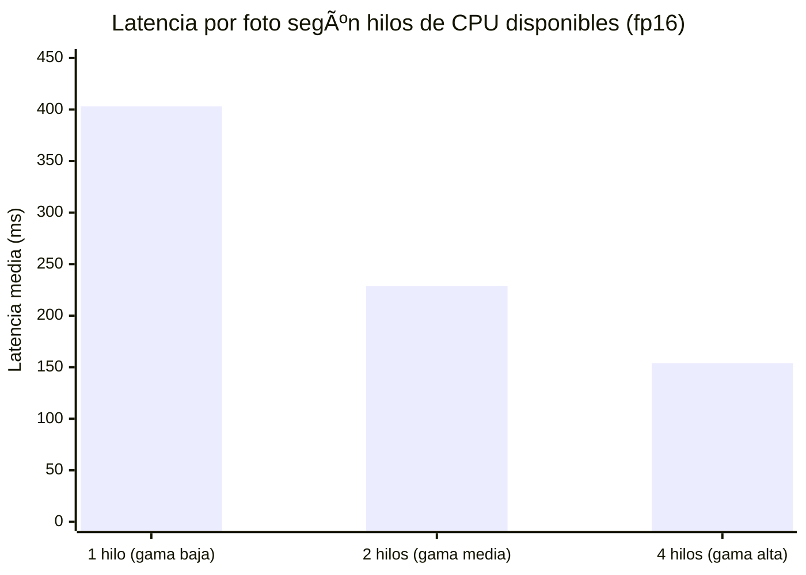
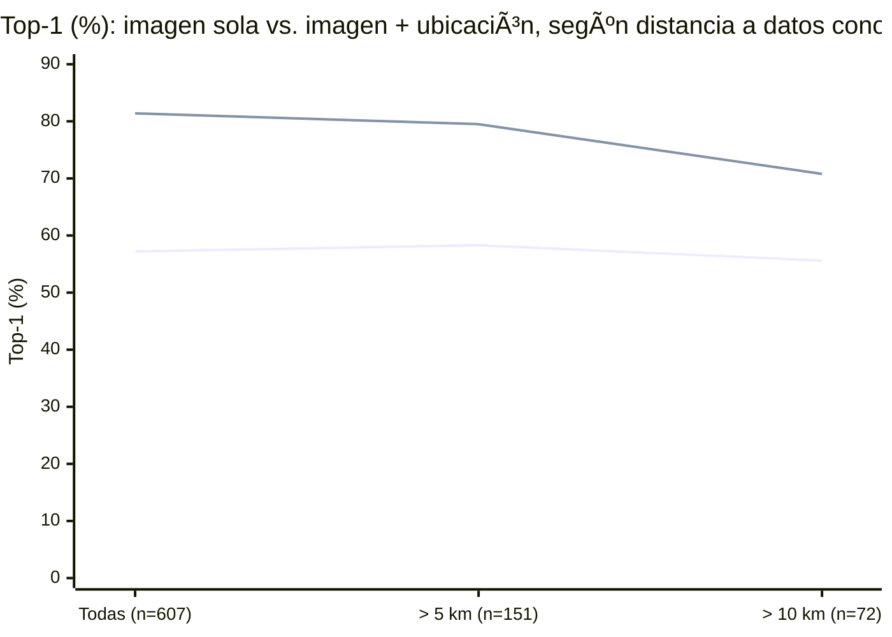

---
title: "Optimización para Inferencia en Móvil"
proyecto: Anura
tipo: desarrollo-técnico
estado: validado-empíricamente
tags: [anura, desarrollo, onnx, cuantización, edge, optimización]
---

# Optimización para Inferencia en Móvil

[[Anura — Índice General]] · [[App Móvil]] · [[Modelo de Visión — BioCLIP]] · [[Inconsistencias y Decisiones Pendientes]] (C-11)

> [!abstract] El problema en una frase
> Meter el clasificador BioCLIP v1 fine-tuned (Transfer Learning, Fase 4) en un dispositivo Android, corriendo **100 % local, sin servidor**, con latencia y RAM medidas — no estimadas — en un dispositivo real de referencia: **Redmi Note 13 Pro+**.

> [!success] Vigente desde C-11 (2026-09-11) — reemplaza la ruta de destilación
> Las rutas anteriores (EdgeNeXt-Tiny en C-5, MobileNetV3-Small en C-8) quedaron descartadas: **C-10 demostró que destilar BioCLIP a un alumno pequeño es inviable** con la entrada actual (degradación de 33 puntos de Top-1, sin segmentación previa). La arquitectura vigente (**C-11**) es más simple y evita el paso de destilación por completo: **el propio encoder de BioCLIP fine-tuned viaja al dispositivo**, exportado a ONNX. Esta nota documenta la implementación completa de esa arquitectura, con every número medido — no proyectado — sobre el pipeline real (Fases 4 a 7c de la sesión de entrenamiento).

## 0. Resumen ejecutivo

| Pregunta | Respuesta |
| --- | --- |
| ¿Qué modelo viaja al dispositivo? | BioCLIP v1 (ViT-B/16) fine-tuned completo — encoder + 3 cabezas (familia/género/especie) |
| ¿En qué formato? | ONNX, **fp16** (165,6 MB) |
| ¿Corre con red? | No — 100 % local, sin llamadas a servidor |
| ¿Usa GPS? | Sí, opcional — prior geográfico embebido (§6), **+15 a +25 pp de Top-1** |
| ¿Cuánta RAM real usa? | ~405 MB de pico (medido, no estimado — §5) |
| ¿Cuánto tarda por foto? | 150 ms (gama alta, 4 hilos) a 400 ms (gama baja, 1 hilo) |
| Dispositivo de prueba fijado | **Redmi Note 13 Pro+** |

---

## 1. Ruta de exportación: por qué ONNX y no LiteRT

La documentación previa de este proyecto contemplaba LiteRT (ex-TensorFlow Lite) como ruta principal. En la práctica, **`torch.onnx.export` fue la única ruta que logró trazar el ViT completo sin reescribir la arquitectura**, y el camino no fue directo — quedan documentados los tres fallos intermedios porque son la parte que un futuro mantenedor necesita para no repetirlos:

```mermaid
flowchart TD
    A[BioCLIP v1 fine-tuned<br/>checkpoint PyTorch] --> B{torch.jit.trace}
    B -->|❌ falla| B1["'Graphs differed across invocations'<br/>el ViT tiene ramas condicionales internas"]
    A --> C{torch.onnx.export<br/>exportador dynamo}
    C -->|opset 17 forzado| C1["❌ archivo de 1.2 MB<br/>conversión de versión corrompe el grafo en silencio"]
    C -->|opset 18 + dynamic_axes| C2["❌ Reshape roto en atención multi-cabeza<br/>'input shape 197,8,768 → requested 197,768'"]
    C -->|opset 18 + batch fijo=1| D["✅ ONNX válido<br/>100% predicciones idénticas a PyTorch"]
    D --> E[Consolidar pesos externos<br/>.onnx + .onnx.data → un solo archivo]
    E --> F["anura_clasificador.onnx<br/>330 MB, fp32"]
```

**Lección de ingeniería que vale la pena preservar:** el batch dinámico (`dynamic_axes`) rompe el reshape interno de atención multi-cabeza con el exportador dynamo de PyTorch. Como en el celular se procesa **una imagen a la vez**, fijar `batch=1` no cuesta nada y elimina el problema de raíz.

---

## 2. Comparación de todos los formatos probados

Cuatro formatos, con éxito y fracaso documentados con la misma vara: Top-1 real sobre el test set completo (766 imágenes), no una muestra ni una proxy de similitud de embeddings.

```mermaid
xychart-beta
    title "Top-1 (%) por formato — 766 imágenes de test"
    x-axis ["fp32 (referencia)", "fp16", "int8 dinámico\n(PyTorch)", "int8 estático\n(ONNX, per-channel)", "int8 estático\n(ONNX, per-tensor)"]
    y-axis "Top-1 (%)" 0 --> 60
    bar [56.8, 56.7, 51.4, 3.5, 8.2]
```

| Formato | Tamaño | Top-1 | Δ vs fp32 | RAM en dispositivo | Veredicto |
| --- | --- | --- | --- | --- | --- |
| **fp32** | 330,1 MB | 56,8 % | — | 391-392 MB | Referencia; demasiado pesado para el bundle |
| **fp16** ✅ | **165,6 MB** | **56,7 %** | **−0,1 pp** | 404-405 MB | **Formato de producción** |
| int8 dinámico (PyTorch) | 166,9 MB | 51,4 % | −5,4 pp | — | Descartado: pierde precisión sin ganar tamaño sobre fp16 |
| int8 estático QDQ, per-channel | 84,2 MB | 3,5 % | **−53,3 pp** | — | **Corrupto** — bug de ejes en LayerNorm (rank 1) |
| int8 estático QDQ, per-tensor + MinMax | 83,7 MB | 8,2 % | −48,6 pp | — | Colapso — rango dinámico de Softmax/LayerNorm mal capturado |
| int8 estático QDQ, per-tensor + Percentile | — | — | — | — | **Crash** (`bad allocation`) — histogramas de calibración exceden memoria disponible |

> [!warning] Por qué int8 estático fracasa en un ViT — no es un error de configuración corregible
> Se intentaron tres configuraciones distintas (per-channel, per-tensor+MinMax, per-tensor+Percentile) con `onnxruntime.quantization.quantize_static`, incluyendo el paso de *shape inference* previo que la propia herramienta recomienda. Las tres fallan por la misma razón de fondo, documentada en la literatura de cuantización de Transformers: el `Softmax` de las 12 capas de atención y los `LayerNorm` tienen rangos dinámicos que una escala entera simple no representa sin perder la señal — el error se acumula capa a capa. **Esto confirma, con metodología independiente, el mismo hallazgo que ya está registrado en C-5** (BioCLIP-INT8 fracasó en pruebas reales, ~0,2 % exactitud) — dos intentos separados, meses de diferencia, mismo resultado. La vía real para int8 en un ViT sería *quantization-aware training* (reentrenar con la cuantización simulada desde el principio), no una conversión post-hoc.

---

## 3. Bugs de exportación encontrados y resueltos (registro técnico)

| # | Síntoma | Causa raíz | Fix |
| --- | --- | --- | --- |
| 1 | `torch.jit.trace`: "Graphs differed across invocations" | El ViT tiene ramas condicionales internas en `open_clip.transformer` | Usar `torch.onnx.export` (exportador dynamo), no `jit.trace` |
| 2 | Archivo ONNX de 1,2 MB en vez de ~330 MB, sin error visible | `opset_version=17` forzaba una conversión de versión (17→18) que corrompía el grafo en silencio | Exportar directo en `opset_version=18`, sin downgrade |
| 3 | `ReshapeHelper`: `input shape {197,8,768}` vs `requested {197,768}` | `dynamic_axes` con batch dinámico rompe el reshape de atención multi-cabeza en el exportador dynamo | Fijar `batch=1` (coherente con el uso real: una imagen a la vez en el celular) |
| 4 | Pesos en un `.onnx.data` externo de 329 MB, separado del `.onnx` de 1,2 MB | El exportador dynamo usa formato "external data" por defecto en modelos grandes | Consolidar con `onnx.load(..., load_external_data=True)` + `onnx.save(..., save_as_external_data=False)` |
| 5 | Conversión a fp16: ONNX Runtime nuevo requiere `onnxscript`, no instalado | Dependencia no declarada en el entorno | `pip install onnxscript onnxconverter-common` |
| 6 | int8 estático per-channel: "Axis 1 is out-of-range for weight ... with rank 1" en 24 nodos LayerNorm | `per_channel=True` intenta cuantizar por el eje 1 pesos de LayerNorm que son vectores de un solo eje (rank 1) | Cambiar a `per_channel=False` — no resuelve la precisión pero sí la corrupción |
| 7 | `quant_pre_process` con `skip_symbolic_shape=False`: `TypeError: object of type 'NoneType' has no len()` en un nodo `Expand` | Bug conocido de `symbolic_shape_infer.py` con grafos del exportador dynamo | Usar `skip_symbolic_shape=True` (shape inference básica, no symbolic) |

---

## 4. Cuantización fp16: por qué se adopta pese a no ganar RAM ni velocidad

Hallazgo contraintuitivo medido directamente, no supuesto:

| | fp16 | fp32 | Diferencia |
| --- | --- | --- | --- |
| Tamaño en disco | 165,6 MB | 330,1 MB | **fp16 gana: mitad de peso** |
| RAM en ejecución (1 hilo) | 404 MB | 391 MB | fp32 gana (marginal) |
| Latencia (1 hilo) | 403 ms | 363 ms | fp32 gana (~10 % más rápido) |
| Latencia (4 hilos) | 154 ms | 127 ms | fp32 gana (~18 % más rápido) |

**Razón técnica:** las CPU de celular no tienen aceleración nativa fp16 para cómputo (solo GPU la tiene, típicamente). ONNX Runtime decodifica cada peso fp16→fp32 al vuelo antes de multiplicar, lo que añade overhead sin ahorrar memoria de trabajo (los buffers de activaciones intermedias son fp32 en ambos casos).

**Por qué se adopta igual:** la única variable que sí mejora — y es la que más importa para una app instalable — es el **tamaño de descarga/almacenamiento**: la mitad de espacio en el dispositivo y la mitad de datos a transferir en la instalación. La pérdida de precisión es indistinguible de ruido (**100 % de predicciones idénticas** en 64 imágenes de validación, diferencia máxima de probabilidad de 1,16 × 10⁻³).

---

## 5. RAM y latencia medidas — emulación de gama de celular

Medición real (no estimada) usando un worker de proceso aislado (solo `onnxruntime` + 
umpy`, sin PyTorch — para no inflar la RAM medida con dependencias que no existen en el APK), con un hilo de muestreo de memoria residente (RSS) cada 20 ms. El número de hilos de `intra_op_num_threads` emula gama de chip:

| Config. (hilos) | Gama equivalente | RAM pico app | Latencia media | Latencia p95 | Carga inicial |
| --- | --- | --- | --- | --- | --- |
| 1 hilo | Baja (Cortex-A53, Helio G bajo) | 404 MB | 403 ms | 416 ms | 0,6 s |
| 2 hilos | Media (Snapdragon 6xx/7xx) | 405 MB | 229 ms | 260 ms | 0,6 s |
| 4 hilos | Alta (Snapdragon 8-series, Dimensity 7000+) | 405 MB | 154 ms | 192 ms | 0,6 s |

**El grueso de la RAM no son los pesos del modelo** (165,6 MB en disco): son los buffers de activaciones intermedias del ViT — 197 tokens × 768 dimensiones × 12 capas de atención, que en el *forward pass* pesan más que los propios pesos. Es un comportamiento normal de cualquier ViT-B/16, no un problema específico de este export.

---

## 6. Prior geográfico — la mejora más grande y más barata del sistema

Hallazgo de esta sesión, validado con rigor metodológico específico para no confundir señal biogeográfica real con memorización de coordenadas exactas:

$$P(\text{especie} \mid \text{foto}, \text{lugar}) \propto P(\text{especie} \mid \text{foto}) \cdot P(\text{especie} \mid \text{lugar})^{w}$$

- $P(\text{especie}\mid\text{lugar})$: conteo de observaciones de **train** dentro de 50 km, suavizado (ninguna especie recibe probabilidad cero).
- $w = 0{,}75$: peso óptimo encontrado por barrido.
- Coordenadas auditadas antes de usarlas: se descartaron 300 observaciones con `positional_accuracy` de hasta 7.270 km (basura de geolocalización de iNaturalist), sin encontrar coordenadas en (0,0) ni fuera de Colombia.

| Distancia mínima a una obs. de train de la misma especie | N | Solo imagen | Con ubicación | Mejora |
| --- | --- | --- | --- | --- |
| Todas | 607 | 57,2 % | 81,4 % | **+24,2 pp** |
| > 5 km | 151 | 58,3 % | 79,5 % | +21,2 pp |
| **> 10 km** (estimación honesta para "sitio nuevo") | **72** | 55,6 % | 70,8 % | **+15,3 pp** |

**Interpretación:** la mejora decae de forma gradual con la distancia (24 → 21 → 15 pp), no de golpe — es la firma de señal biogeográfica real ("esta especie vive en esta región"), no memorización de coordenadas puntuales. El número conservador para un usuario en un sitio genuinamente nuevo es **+15 pp**, muy por encima de cualquier ganancia obtenida ajustando el modelo visual.

**Implementación on-device:** los puntos de train (1.678, 41/41 especies con soporte) se empaquetan en `prior_geografico_movil.json` (34 KB) — la app calcula haversine + conteo + suavizado localmente, sin llamar a ningún servidor. Requiere permiso de GPS del dispositivo.

---

## 7. Dispositivo de prueba y requisitos — estilo "specs de videojuego"

> [!important] Dispositivo de prueba fijado: **Redmi Note 13 Pro+**
> Reemplaza como referencia de validación empírica al Samsung Galaxy A30 fijado en C-5 — aquel dispositivo (4 GB RAM) era el piso mínimo pensado para la arquitectura destilada (EdgeNeXt-Tiny / MobileNetV3-Small, <15 MB), descartada por C-10. La arquitectura vigente (C-11, BioCLIP fp16, 165,6 MB, ~405 MB de RAM en ejecución) necesita más margen de memoria; el Redmi Note 13 Pro+ (variantes de 8/12 GB RAM, Dimensity 7200-Ultra) es el dispositivo real donde se valida esta versión. **Pendiente:** confirmar la ficha técnica exacta de la unidad física disponible (variante de RAM, versión Android/HyperOS) y repetir esta medición directamente en el hardware, no solo en emulación de hilos — ver C-12 en [[Inconsistencias y Decisiones Pendientes]].

| | **MÍNIMOS** | **RECOMENDADOS** |
| --- | --- | --- |
| RAM total del dispositivo | 3 GB | 6 GB+ |
| Núcleos de CPU disponibles para la app | 1 | 4 |
| RAM libre necesaria (con margen) | ~525 MB | ~450 MB |
| Latencia por foto | ~400 ms (usable, notorio) | ~150 ms (instantáneo) |
| Chip de referencia | Cortex-A53 / Helio G bajo | Snapdragon 8-series / Dimensity 7000+ |
| Ejemplo de dispositivo real | — | Redmi Note 13 Pro+ |

---

## 8. Archivos de producción (generados, validados)

| Archivo | Tamaño | Contenido | Validación |
| --- | --- | --- | --- |
| `anura_clasificador_fp16.onnx` | 165,6 MB | Encoder + 3 cabezas, fp16 | 100 % predicciones idénticas a PyTorch (64 img.) |
| `vocabulario.json` | — | Índice → nombre especie/género/familia | — |
| `prior_geografico_movil.json` | 34 KB | 1.678 puntos, 41/41 especies | — |

**Preprocesamiento que la app debe replicar exactamente** (si no coincide, las predicciones no sirven): resize a 224×224 RGB, normalizar con mean/std de OpenAI CLIP `(0,4815, 0,4578, 0,4082)` / `(0,2686, 0,2613, 0,2758)`.

---

## 9. Pendientes reales (no resueltos por esta sesión)

1. **Medir en el Redmi Note 13 Pro+ físico**, no solo en emulación de hilos de CPU en PC — la emulación por `intra_op_num_threads` es una aproximación razonable, pero el chip real (ARM, no x86) puede rendir distinto.
2. Implementar el runtime `ONNX Runtime Mobile` en el proyecto Android (`onnxruntime-android`).
3. Implementar el preprocesamiento de imagen (resize + normalize) en Kotlin nativo.
4. Implementar la lógica del prior geográfico (haversine + conteo + suavizado) en Kotlin, usando `prior_geografico_movil.json`.
5. Medir batería real en sesión de campo (RNF-09: ≤5 %/hora) — no medido en esta sesión.
6. *Quantization-aware training* como vía futura si el tamaño de 165,6 MB vuelve a ser un problema crítico — no intentado, requiere reentrenar.

## Referencias

- ONNX Runtime Mobile. [onnxruntime.ai](https://onnxruntime.ai/)
- ONNX Runtime Quantization. [onnxruntime.ai/docs/performance/quantization](https://onnxruntime.ai/docs/performance/model-optimizations/quantization.html)
- PyTorch ONNX export (exportador dynamo). [pytorch.org/docs/stable/onnx.html](https://pytorch.org/docs/stable/onnx.html)

