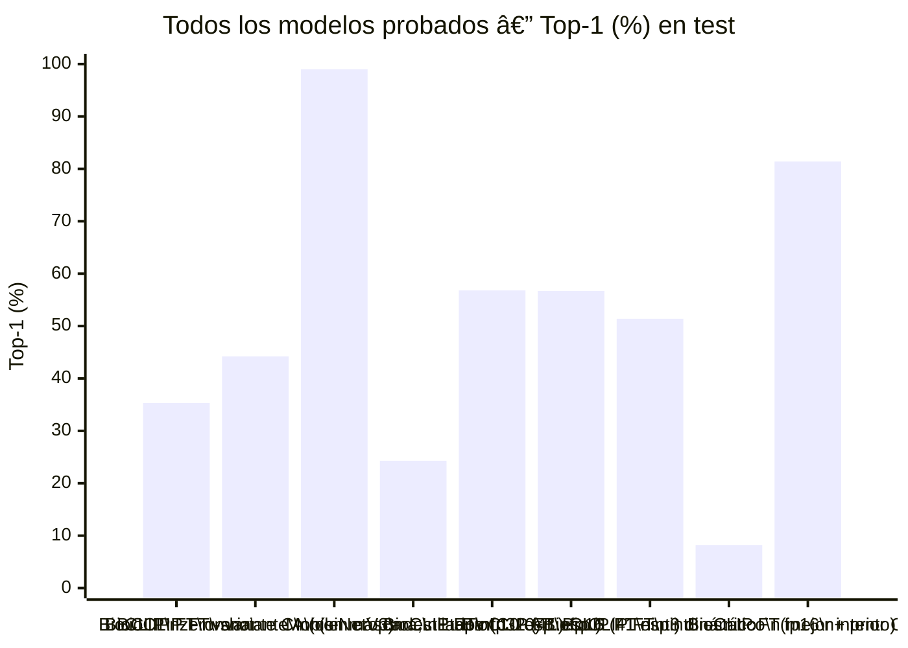

---
title: "Experimentos y Resultados"
proyecto: Anura
tipo: evaluación
estado: bitácora-activa
tags: [anura, evaluación, experimentos, bitácora]
---

# Experimentos y Resultados

[[Anura — àndice General]] · [[Evaluación y Métricas — àndice]] · [[Métricas Offline]] · [[Ciclo de Vida del Modelo (MLOps)]]

> [!abstract] Cómo usar esta nota
> Bitácora cronológica de experimentos. Un experimento = una pregunta con una respuesta medida. Se registra **antes** de ejecutarlo (objetivo e hipótesis) y se completa después (resultados y decisión). Registrar la hipótesis antes evita el sesgo de reinterpretar el resultado a conveniencia.

## Registro de experimentos

| ID | Fecha | Pregunta | Resultado | Decisión |
| --- | --- | --- | --- | --- |
| EXP-001 | 2026-09-11 | ¿Cuánto gana el Transfer Learning sobre BioCLIP zero-shot, con oversampling proporcional y class weights, sobre las 41 especies? | Top-1 test: 35,3 %→44,2 % (Fase A, solo cabezas) →54,4 %→**57,0 %** (Fase B, fine-tune) | ✅ Se adopta como checkpoint base (`bioclip_anura_mejor.pt`) |
| EXP-002 | 2026-09-11 | ¿El 57 % Top-1 está parejo entre especies o lo arrastran unas pocas escasas? | Escasas (<45 ind. reales): 53,1 % · Abundantes (≥45): 56,7 % — **hipótesis de daño por escasez rechazada**; el problema es concentrado en Dendropsophus (similitud morfológica real, no datos) | ✅ No relanzar con más oversampling; el techo es taxonómico |
| EXP-003 | 2026-09-11 | Las fotos mal clasificadas en Dendropsophus, ¿son mal etiquetado o confusión genuina? | Revisión visual de 97 fallos: mismo patrón de "máscara" oscura/dorada en `ebraccatus` y `triangulum` (par más confundido, 15 casos) — confusión real, no error de datos. Se encontraron y limpiaron 2 casos reales de ruido: 1 foto de amplexo (2 individuos) y 1 individuo con protocolo de manejo en mano | ✅ Eliminadas 2 fotos; el resto del daño se acepta como límite biológico del género |
| EXP-004 | 2026-09-12 | ¿Cuántas fotos de manejo (mano) o amplexo (màºltiples individuos) contaminan las 41 especies? | Detector CLIP zero-shot texto-imagen: 2.091/12.256 candidatas (umbral bajo, ruidoso) → 50 candidatas de alta confianza (margen > 0,10). Calibración manual: ~65-70 % precisión (2/3 verdaderos en muestra) | 🟡 Lista generada, pendiente de revisión manual completa por el autor |
| EXP-005 | 2026-09-12 | ¿El vientre translàºcido de Sachatamia (rana de cristal) debe descartarse como el resto de fotos de mano? | No — es el rasgo diagnóstico que da nombre al grupo. Encontrada 1 foto con el corazón visible a través de la piel ventral, en mano. Clasificador automático dorsal/ventral con prompts de texto no fue confiable (falso positivo en foto de amplexo dorsal) | ✅ Revisión manual 1x1 de 41 fotos; eliminada 1 de amplexo, conservado el resto con categoría especial |
| EXP-006 | 2026-09-12 | ¿Cuánto degrada fp16 y cuánto degrada int8 el clasificador completo, en CPU real? | fp16: −0,1 pp (56,8→56,7 %). int8 dinámico (PyTorch): −5,4 pp, y solo 1,17à— más rápido en CPU (no el 2-3à— esperado) | ✅ fp16 adoptado; int8 dinámico descartado |
| EXP-007 | 2026-09-12 | ¿Cuánto mejora el reconocimiento si se usa la ubicación GPS como prior? | +24,9 pp en el test completo; **+15,3 pp** en el subconjunto geográficamente aislado (>10 km de train, n=72) — la mejora decae con la distancia de forma gradual, señal de biogeografía real, no memorización de coordenadas | ✅ Se adopta (`w=0,75`), pendiente de implementación en Kotlin |
| EXP-008 | 2026-09-12 | ¿Se puede exportar el clasificador completo (no solo el encoder) a ONNX para producción móvil? | Sí, tras resolver 4 bugs de exportación distintos (ver [[Optimización para Inferencia en Móvil]] §3). 100 % de predicciones idénticas a PyTorch en validación | ✅ `anura_clasificador_fp16.onnx` (165,6 MB) es el artefacto de producción |
| EXP-009 | 2026-09-12 | ¿Cuánta RAM y latencia real usa el modelo en emulación de gama de celular (1/2/4 hilos)? | RAM: ~405 MB de pico (constante entre 1-4 hilos). Latencia: 403 ms (1 hilo) → 154 ms (4 hilos) | ✅ Requisitos mínimos/recomendados fijados en [[Optimización para Inferencia en Móvil]] §7 |
| EXP-010 | 2026-09-12 | ¿Puede la cuantización estática int8 de ONNX Runtime (distinta de la dinámica de PyTorch) reducir RAM sin destruir la precisión? | **No, en tres configuraciones distintas**: per-channel corrompe (3,5 % Top-1, bug de ejes en LayerNorm), per-tensor+MinMax colapsa (8,2 %), per-tensor+Percentile revienta por memoria. Confirma de forma independiente el hallazgo de C-5 (BioCLIP-INT8: ~0,2 % en esa corrida) | ❌ Descartado sin remedio simple — la vía real sería *quantization-aware training* |
| EXP-011 | 2026-09-11 | ¿La variante C (recorte + máscara de segmentación binaria) sigue mejorando el Top-1 al escalar de 10 a 41 especies? | **No** — peor que sin segmentar en el mismo tramo de entrenamiento (Top-1 especie 26,5→32,8 % en 5 épocas de cabezas, vs. 35,3→41,9 % en variante A). Máscaras confirmadas disponibles y usables (99,1-99,3 % del dataset) — no fue un problema de cobertura de datos | 🟡 Corrida abandonada esa noche; se retomó variante A (imagen completa) para el checkpoint de producción. Aclarado por el autor (2026-09-12, C-13): el segmentador usado es el **binario**, no el semántico (16 etiquetas), que sigue en desarrollo aparte |
| EXP-012 | 2026-09-12 | Diagnóstico de EXP-011: ¿por qué empeora el recorte binario, y arreglarlo lo revierte? | **Causa encontrada y confirmada con evidencia visual y cuantitativa**: el segmentador se entrenó con 9 especies y se aplicó a 41 (domain shift real); `fg_medio` de solo 6-18 % en todo el dataset; y un **bug de diseño** — el recorte tomaba el bbox de *todos* los píxeles marcados, sin filtrar componentes conexos (34,2 % de las máscaras de `Dendrobates_truncatus` tienen ≥2 islas separadas de ruido, inflando el bbox al doble del área real de la rana). **Tras aplicar el fix** (componente conexo más grande) y repetir en inferencia pareada sobre 150 imágenes de test (38 especies aleatorias, mismo modelo, mismas imágenes): **el recorte arreglado sigue siendo peor que la imagen completa (60,7 %→50,7 % Top-1, −10 pp)** | 🟡 El fix por sí solo, aplicado solo en *inferencia* a un modelo que nunca vio recortes en entrenamiento, no resuelve el problema por sí mismo — ver EXP-013, que encontró un segundo problema |
| EXP-013 | 2026-09-12 | El código de variante C ¿aplica la máscara pixel a pixel (fondo a negro) como documenta [[Modelo de Visión — BioCLIP]] §5, o solo recorta? | **Solo recortaba** — nunca ponía el fondo a negro, dejando todo el fondo original visible dentro del bbox. Corregido, y repetido el experimento pareado con 3 vías (completa / zoom sin máscara / zoom con fondo a negro): **el fondo a negro es AàšN PEOR que solo el zoom** (44,7 % vs. 50,7 % vs. 60,7 % Top-1). Contradice la hipótesis de que faltaba aplicar bien la máscara — aplicarla correctamente empeora más, porque un fondo negro artificial es una distribución más lejana de lo que BioCLIP (preentrenado en fotos naturales) conoce que un simple cambio de encuadre | ❌ Ninguna de las dos correcciones, aplicadas solo en inferencia, arregla el problema — ambas son evidencia de mismatch de dominio, no de que la variante C sea mala per se. **Pendiente real, sin probar todavía: reentrenar Fase 4 desde cero sobre el recorte con fondo a negro (variante C real, con ambos fixes)** |
| EXP-014 | 2026-09-13 | ¿Cuánta precisión se pierde (o gana) al pasar del clasificador softmax (Ruta A) a k-NN sobre embeddings + SQLite-vec (Ruta B, firmada en C-15 para cumplir el patrón Merlin)? | Mismo encoder (checkpoint de Fase 4), mismo test set de 766 imágenes que Fase 5, 3.260 embeddings de train como base de referencia (1 imagen del manifiesto ya no existe en disco, omitida). **1-NN puro: 53,9 % Top-1 / 77,9 % Top-3 (−3,1 pp vs. clasificador). k-NN (k=5, voto ponderado por similitud): 56,4 % Top-1 / 77,9 % Top-3 (−0,7 pp vs. clasificador)**, con las **41 especies completas** en el paquete de referencia. El Top-3 pierde más (−4,5 pp) porque el voto por k=5 vecinos satura antes que las probabilidades softmax de 41 clases | 🟡 Válido solo como techo pesimista — ver EXP-015, que mide con un paquete regional real (menos especies candidatas) y encuentra el resultado opuesto |
| EXP-015 | 2026-09-13 | Repetir EXP-014 pero con un paquete regional **real** (Antioquia, filtrado geográficamente, no las 41 especies completas) — ¿sigue perdiendo precisión la Ruta B frente al clasificador? | Se exportó primero el **encoder solo a ONNX** (pendiente detectado en C-15 — Fase 6 solo dejó `.pt`, nunca se había exportado a ONNX): `encoder_anura_fp16.onnx` (165,4 MB), validado con similitud coseno 0,999999 vs. PyTorch en 64 imágenes reales. Luego se filtraron las especies con presencia real en Antioquia usando las coordenadas ya auditadas de `prior_geografico_movil.json` (bbox del departamento, ≥3 observaciones de train dentro): **25 de 41 especies** califican. Sobre las 467 imágenes de test (de 766) cuya especie real es una de esas 25: **Ruta B (k-NN k=5, paquete de 25 especies): 66,2 % Top-1 / 83,7 % Top-3. Ruta A (clasificador de 41 clases, mismo subconjunto de test): 54,4 % Top-1 / 79,9 % Top-3.** **Δ Top-1 = +11,8 pp a favor de Ruta B** — se invierte por completo el resultado de EXP-014 | ✅ **Ruta B con paquete regional filtrado es MEJOR que el clasificador, no solo "aceptablemente peor"**. La causa es mecánica, no casualidad: el clasificador de 41 clases siempre reparte probabilidad entre las 16 especies que NO son de Antioquia (puro desperdicio de masa de probabilidad para un usuario en Antioquia); el k-NN sobre el paquete regional nunca compara contra esas 16, así que cada vecino "cuenta" solo entre candidatos plausibles. Esto es evidencia directa de que segmentar por región (el corazón del patrón Merlin) no es solo una conveniencia de descarga — es una mejora de precisión real. Se generó `antioquia_v1.sqlite` (6,39 MB, 2.073 vectores, 25 especies) como el primer paquete regional filtrado geográficamente de verdad — ver [[Base Vectorial (SQLite-vec)]] |

---

## Plantilla

```markdown
### EXP-000 — [Título corto]

**Fecha:** 
**Responsable:** 

**Objetivo**
Qué se quiere averiguar, en una frase.

**Hipótesis** (antes de ejecutar)
Qué se espera que ocurra y por qué.

**Configuración**
| Elemento | Valor |
| --- | --- |
| Modelo / backbone | |
| Versión de dataset | |
| Split | |
| Hiperparámetros | |
| Augmentación | |
| Semilla | |
| Hardware | |
| Duración | |

**Resultados**
| Métrica | Base | Este experimento | Δ |
| --- | --- | --- | --- |

**Análisis**
Qué pasó y por qué. Incluir lo que no encaja con la hipótesis.

**Decisión**
- [ ] Se adopta
- [ ] Se descarta
- [ ] Requiere más experimentos

**Siguiente paso**
```

---

## Cola de experimentos planificados

Priorizados. Los cuatro primeros son los que sostienen el capítulo de resultados.

| Prioridad | Experimento | Pregunta | Nota de referencia |
| --- | --- | --- | --- |
| **1** | Línea base BioCLIP zero-shot | ¿Cuánto sabe el modelo sin ver una sola foto del dataset? | [[Modelo de Visión — BioCLIP]] |
| **1** | Documentar formalmente el protocolo de la Etapa I | El ~99 % ya está explicado (segmentación binaria + `GroupSplit` por individuo) — falta dejar el desglose completo y la arquitectura del segmentador binario por escrito | [[Modelo de Visión — BioCLIP]] §7 |
| **1** | Entrada A/B/C (completa / recorte / recorte+máscara) | ¿Se sostiene la ventaja de la máscara binaria (variante C) al escalar el catálogo? | [[Modelo de Visión — BioCLIP]] §5 |
| **1** | Ablación multimodal | ¿Cuánto aporta cada modalidad? | [[Arquitectura Multimodal]] §4 |
| 2 | BioCLIP compartido vs. modelo acàºstico dedicado | ¿Reutilizar BioCLIP para audio rinde cerca de un modelo especializado (BirdNET/PANNs/AnuraSet)? | [[Modelo de Visión — BioCLIP]] §9 |
| 2 | Open-set: MSP vs. Energy vs. Mahalanobis | ¿Qué detector de desconocidos usar? | [[Open-Set Recognition]] |
| 2 | Impacto de la cuantización | ¿Cabe en móvil sin perder más del 2 % de F1? | [[Optimización para Inferencia en Móvil]] |
| 2 | Validación de sqlite-vec en dispositivo | ¿Latencia y memoria dentro de presupuesto con 10–50 k vectores? | [[Base Vectorial (SQLite-vec)]] §2 |
| 3 | Triplet loss vs. embeddings congelados | ¿Compensa el metric learning con este dataset? | [[Implementación de Triplet Loss]] |
| 3 | Recuperación vectorial | ¿Los vecinos más cercanos son de la especie correcta? | ✅ Resuelto — ver EXP-014 abajo |
| 3 | Clasificación jerárquica con y sin enmascarado | ¿Cuántas predicciones incoherentes se evitan? | [[Modelo de Visión — BioCLIP]] §4 |

## Resultados consolidados

Se rellena a medida que se cierran experimentos. Es el material directo del capítulo de resultados.

### Hallazgo 1 — La segmentación binaria explicó el ~99 % de la Etapa I, pero **no se sostuvo al escalar a 41 especies**

Con 10 especies, 70 individuos por especie, segmentación binaria (individuo vs. fondo) aplicada antes de pasar el recorte a BioCLIP, y `GroupSplit` por individuo, la Etapa I alcanzó **~99 % de exactitud**. No es un artefacto de fuga de información: las tres condiciones que normalmente inflan un resultado (fondo como atajo, mismo individuo en train y test, pocas variantes por clase) están controladas por diseño. Detalle completo en [[Modelo de Visión — BioCLIP]] §7.

> [!warning] Actualización 2026-09-12 — la implicación original de este hallazgo queda revisada
> Se probó la misma variante C (segmentada) sobre las 41 especies el 2026-09-11 (ver EXP-011) y dio **peor** resultado que sin segmentar en el mismo tramo de entrenamiento (Top-1 especie 26,5→32,8 % vs. 35,3→41,9 % sin segmentar). Aclarado por el autor: el segmentador usado en esa corrida es el **binario** (el mismo tipo que sostiene el 99 % de arriba) — no el de segmentación **semántica** (16 etiquetas anatómicas), que sigue en desarrollo aparte y no se ha probado todavía en el pipeline de identificación. La implicación ya no es "segmentar antes de clasificar no es opcional" sin matiz: es opcional **hasta que se entienda por qué el segmentador binario empeora el resultado al escalar** (¿calidad de máscara en datos de campo más heterogéneos? ¿el corte binario elimina contexto àºtil que el ViT sí aprovechaba?). Por ahora, el pipeline de producción (Fases 4-7, checkpoint vigente) usa **variante A (imagen completa, sin segmentar)**.

### Hallazgo 2 — La ubicación GPS aporta más que cualquier ajuste al modelo visual

Un prior geográfico simple (conteo de observaciones de train en 50 km, suavizado, combinado con peso 0,75) mejora el Top-1 de **57 % a 81 %** sobre el test completo, y de forma conservadora (>10 km de cualquier punto conocido) sigue aportando **+15 pp**. Para comparación: todo el fine-tuning de Fase 4 (oversampling + class weights + augmentación agresiva) ganó +8,9 pp sobre el zero-shot. La ubicación, con una implementación mucho más simple, gana casi el triple. Detalle y validación anti-fuga en [[Optimización para Inferencia en Móvil]] §6.

### Hallazgo 3 — Un ViT no se puede cuantizar a int8 "de fábrica", con ninguna herramienta estándar probada

Se intentó int8 por dos caminos (cuantización dinámica de PyTorch, cuantización estática de ONNX Runtime en tres configuraciones) y los cinco intentos degradan el modelo a niveles inutilizables o peores que fp16 en tamaño real. Esto **confirma de forma independiente**, meses después y con herramientas distintas, el mismo hallazgo de C-5 (BioCLIP-INT8 fracasó en pruebas reales, ~0,2 % exactitud). La causa de fondo (documentada en la literatura de cuantización de Transformers) es que el `Softmax` de atención y los `LayerNorm` tienen rangos dinámicos que una escala entera simple no representa sin perder la señal. **fp16 es el techo práctico de compresión sin reentrenar.**

### Hallazgo 4 — El recorte binario, incluso arreglado (y aplicado como se documentó originalmente), no sirve sin reentrenar (EXP-011/EXP-012/EXP-013)

Diagnóstico completo del fracaso de variante C en el escalado a 41 especies, con evidencia visual y cuantitativa. Dos problemas distintos encontrados y aislados por separado:

**Problema 1 — bug de diseño en el bbox.** `_recortar_por_mascara` tomaba el bounding-box de **todos** los píxeles marcados como foreground por el segmentador, sin distinguir la rana del ruido disperso. Con el segmentador entrenado en solo 9 especies y aplicado a 41, ese ruido es frecuente (34,2 % de las máscaras de `Dendrobates_truncatus` tienen ≥2 componentes separados) y un solo falso positivo lejano estira el recorte hasta casi la imagen completa. Fix: quedarse con el componente conexo más grande.

**Problema 2 — el código nunca aplicaba la máscara sobre los píxeles.** La definición documentada de variante C ([[Modelo de Visión — BioCLIP]] §5, la que sostuvo el ~99 % de la Etapa I) es *"recorte **con fondo puesto a negro/neutro** usando la máscara binaria"* — no solo un zoom rectangular. El código de Fase 4 solo hacía el recorte, dejando el fondo original completamente visible dentro de la caja. Fix: enmascarar pixel a pixel (fondo a negro) antes de recortar.

**Diez ejemplos reales, 3 paneles cada uno** (original | zoom sin máscara | zoom con fondo a negro — la variante C real):

![[00_Dendrobates_truncatus_fg2%_bbox3%.jpg]]
![[03_Phyllomedusa_venusta_fg3%_bbox4%.jpg]]
![[05_Boana_xerophylla_fg39%_bbox69%.jpg]]

*(el resto de las 10 imágenes están en `99 Recursos/Attachments/exp_ab_recorte/`)*

**Experimento pareado de 3 vías:** mismo checkpoint (Fase 4, entrenado en variante A), mismas 150 imágenes de test (38 especies aleatorias, semilla fija):

![[exp_ab_grafico.png]]

| | Top-1 | Top-3 |
| --- | --- | --- |
| Imagen completa | **60,7 %** | **83,3 %** |
| Recorte zoom (sin máscara) | 50,7 % | 80,7 % |
| **Recorte + fondo a negro (variante C real)** | **44,7 %** | **75,3 %** |

**Resultado que contradice la hipótesis inicial de "falta aplicar bien la máscara":** aplicar la máscara real (fondo a negro, como en la Etapa I) **no arregla el problema — lo empeora todavía más** que solo el zoom (de 32 casos dañados, contra 23 del zoom solo). Interpretación: BioCLIP fue preentrenado sobre millones de fotos naturales (TreeOfLife-10M) y el fine-tuning de Fase 4 vio siempre fondo natural — un fondo negro artificial es una distribución de imagen más lejana de lo que el modelo conoce que un simple cambio de encuadre. Cuanto más se aleja la entrada de lo visto en entrenamiento, peor rinde (ver el panel de dispersión: los puntos de "fondo a negro" caen sistemáticamente más bajo que los de "solo zoom").

**Lo que esto NO demuestra:** que la variante C sea inherentemente mala. Los tres formatos se evaluaron con un modelo que solo vio imagen completa en entrenamiento — es exactamente el mismatch de dominio esperado en cualquiera de las dos transformaciones. La pregunta que sigue abierta y sin responder: **¿mejora el Top-1 si Fase 4 se reentrena desde cero sobre el recorte con fondo a negro (la variante C real, con ambos fixes ya aplicados)?** Es el àºnico experimento que puede decidir si variante C vuelve a ser viable — nada de lo hecho hoy lo prueba ni lo descarta.

## Gráfico consolidado — rendimiento de todos los modelos probados (éxito y fracaso)

Todo lo que se intentó para el backbone de identificación, en una sola vista. Eje Y = Top-1 sobre test; el color/orden separa qué arquitectura y qué formato de despliegue.



**Lectura del gráfico:**
- La barra de **99 %** (Etapa I, 10 especies, con segmentación **binaria**) y la de **57 %** (41 especies, sin segmentación) no son comparables directamente — distinto nàºmero de especies, y la segmentación binaria **ya se probó** en las 41 especies (EXP-011, 11 sep) y dio peor resultado, no mejor. No es un experimento pendiente: es un experimento hecho con resultado negativo, sin diagnosticar todavía. La segmentación **semántica** (16 etiquetas anatómicas) sigue sin probarse en este pipeline.
- La barra de **destilación MobileNetV3 (C-10, 24,3 %)** es la que motivó abandonar esa ruta — comparada con las variantes de BioCLIP fp32/fp16 (56,7-56,8 %), la brecha de 32 puntos es la evidencia directa de por qué C-11 evita destilar.
- La barra final, **fp16 + prior GPS (81,4 %)**, es el mejor nàºmero de todo el proyecto hasta ahora para el catálogo de 41 especies — y es el que se debe reportar como resultado principal del capítulo de resultados, con la salvedad honesta del +15 pp en el subconjunto aislado (Hallazgo 2).

## Experimentos descartados

Igual de importantes: documentan qué no funcionó y evitan repetirlo.

| ID | Qué se probó | Por qué se descartó |
| --- | --- | --- |
| C-5 | BioCLIP-INT8 (pesos INT8 + activaciones FP16) como backbone on-device | ~0,2 % exactitud — outliers de atención del ViT destruidos por la cuantización |
| C-10 | Destilación BioCLIP v1 → MobileNetV3-Small (Multi-Head Loss) | Top-1 teacher 57,7 % → student 24,3 % (degradación de 33 puntos, objetivo <10). Sin segmentación previa, la imagen completa no da señal suficiente al alumno pequeño |
| EXP-006/EXP-010 | int8 dinámico (PyTorch) e int8 estático (ONNX, 3 configuraciones) sobre el clasificador completo fp32 | Dinámico: −5,4 pp sin ganancia real de tamaño ni velocidad sobre fp16. Estático: corrupción total o colapso (3,5-8,2 % Top-1) en las tres configuraciones probadas |
| — | `opset_version=17` forzado en la exportación ONNX | Corrompía el grafo en silencio (archivo de 1,2 MB en vez de ~330 MB) — ver [[Optimización para Inferencia en Móvil]] §3 |
| — | `dynamic_axes` (batch dinámico) en la exportación ONNX | Rompía el reshape de atención multi-cabeza del exportador dynamo |

> [!tip] Herramienta de seguimiento
> Esta nota funciona como bitácora legible y para el documento escrito. Para el detalle numérico (curvas, hiperparámetros, artefactos) conviene MLflow o Weights & Biases, y enlazar aquí la ejecución correspondiente. Ver [[Ciclo de Vida del Modelo (MLOps)]].


